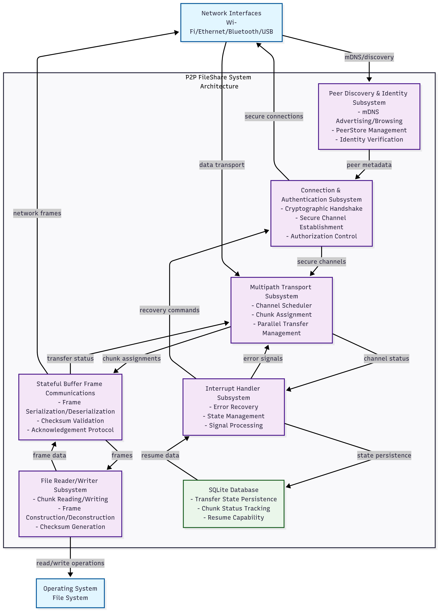
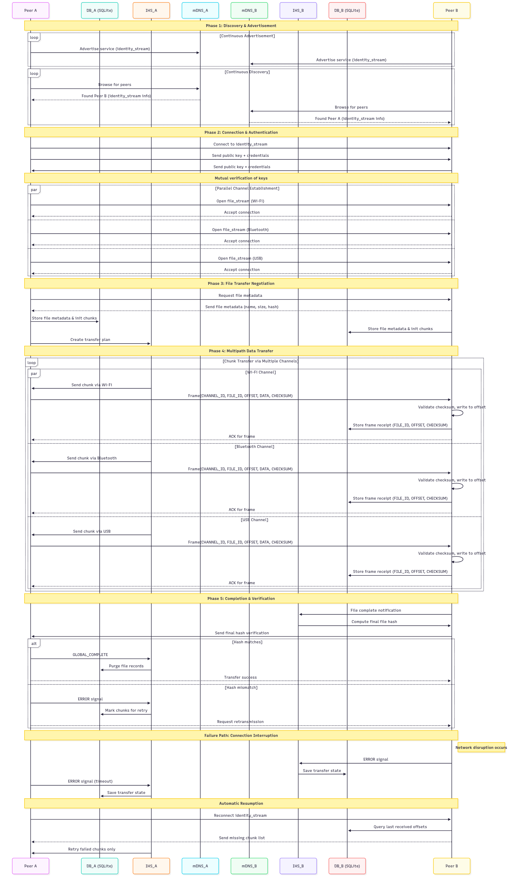

# P2P FileShare System: UniShare

## Component Diagram

## Interaction Diagram

## Core Principles
- **Pure P2P Architecture:** All peers are equal participants (both clients and servers).
- **Local Network Focus:** Designed for LAN environments using mDNS; no NAT traversal required.
- **Security First:** All communication is authenticated and encrypted.
- **Multipath Transport:** Leverage all available local interfaces (Wi-Fi, Bluetooth, USB) concurrently for maximum throughput.
- **Resumability:** All transfers are stateful and can be resumed from any point after an interruption.

---

## Peer Discovery & Identity Subsystem (via mDNS)
- **All Peers** continuously advertise their presence via mDNS.
- **Advertisement Data (`identity_stream` service)** includes:
    - Peer Name (user-defined)
    - Public Key (for authentication and encryption)
    - Supported Protocols/Channels
    - List of available shared files (metadata: name, size, cryptographic hash)
- **All Peers** continuously browse for other peers, maintaining a dynamic `peerstore`.
- **`peerstore`** stores the active list of peers, their public keys, and their advertised files.

---

## Connection, Verification & Authentication Subsystem
- **Asymmetric Cryptography:** Each peer has a persistent public/private key pair. The public key is its immutable identity.
- **Connection Handshake:**
    1.  Initiating peer connects to the `identity_stream` of a discovered peer.
    2.  Peers exchange and verify each other's public keys.
    3.  A secure, authenticated channel is established on the `identity_stream` (e.g., using a key exchange like ECDH followed by symmetric encryption).
- **Authorization:** The `identity_stream` is used for all control messages: file requests, chunk negotiation, and transfer termination.

---

## Multipath Transport Subsystem
- **Chunk-Based Parallel Transfer:**
    - A file is logically divided into chunks.
    - Each available physical channel (Wi-Fi, Bluetooth, USB) is assigned a separate data connection (`file_stream`)

- **Concurrency Model:**
    - **Per-Channel Connection:** Each data channel establishes its own independent, encrypted `file_stream` connection on a unique port.
    - **Channel Scheduler:** A central scheduler assigns specific file chunks to each available channel to maximize parallelization.
    - **No Global Mutex:** Writers for each channel operate independently and concurrently on their own dedicated connections.

---

## Stateful Buffer Frame Communications Subsystem
- **Frame Structure:** Data is transmitted in serialized frames (using **FlatBuffers**). Each frame contains:
    - `CHANNEL_ID`
    - `FILE_ID`
    - `OFFSET` (or `CHUNK_ID`)
    - `DATA`
    - `CHECKSUM` (for the frame)
- **Reliability:** The receiver acknowledges received frames. Unacknowledged frames are re-queued for retransmission by the IHS.

---

## File Reader/Writer Subsystem
- **File Sender (Reader):**
    - Reads a specific chunk from disk as requested by the scheduler.
    - Wraps the chunk data in a stateful frame.
    - Passes the frame to the appropriate channel writer for its connection.
- **File Receiver (Writer):**
    - Listens for incoming frames on multiple `file_stream` connections.
    - Writes the `DATA` payload to the exact `OFFSET` in the target file.
    - Validates the frame's `CHECKSUM`.
    - Sends an acknowledgment for the frame back to the sender.
    - On checksum or write error, sends an **ERROR SIGNAL** for the specific frame to the IHS.

---

## Interrupt Handler Subsystem (IHS)
- **Centralized Error and State Management:** Continuously monitors all channels for signals.
- **Handles Signals:**
    - **ERROR (Per-Channel/Per-Frame):**
        - Logs the failed frame and its channel to the SQLite DB.
        - Attempts to re-establish the specific failed channel connection.
        - On reconnection, instructs the scheduler to re-send the failed chunks.
    - **CHANNEL_COMPLETE:**
        - Notified when a channel finishes its assigned chunks.
    - **FILE_COMPLETE:**
        - Computes the cryptographic hash (e.g., SHA-256) of the fully received file.
        - Compares it with the hash received in the initial file metadata.
        - On match, sends a **GLOBAL_COMPLETE** signal. On mismatch, triggers an **ERROR** for the file.
    - **USER_STOP:**
        - Saves the state of all ongoing transfers for all chunks to the DB and gracefully terminates all connections.

---

## Restore / Save Subsystem (SQLite Database)
- **Persists Transfer State:** Stores the state for *each file* and *each chunk* within the file.
- **Database Schema** tracks:
    - `Files`: File metadata (name, size, final hash, path).
    - `Chunks`: Chunk size, offset, status (pending, in-progress, completed, error), assigned channel, and retry count.
- **On Startup:** The system checks the DB for any transfers with a status of `in-progress` or `error` and automatically attempts to resume them by contacting the source peer and requesting the missing chunks.
- **On Completion:** All records for the successful file transfer are purged from the database.
